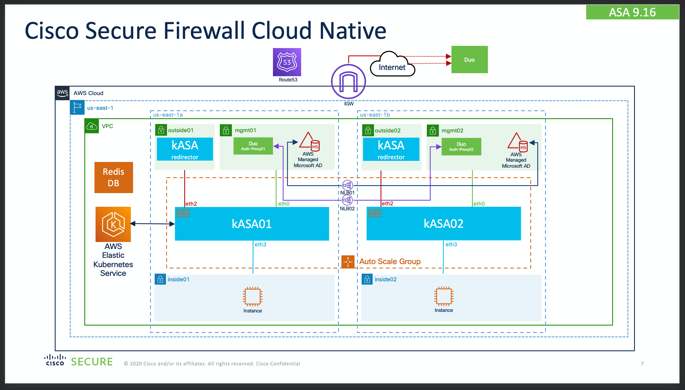
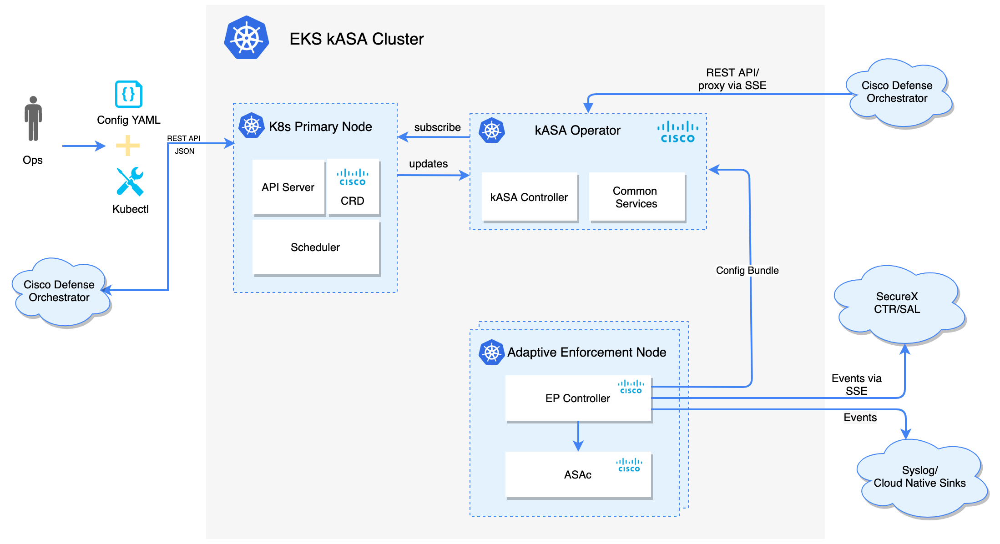
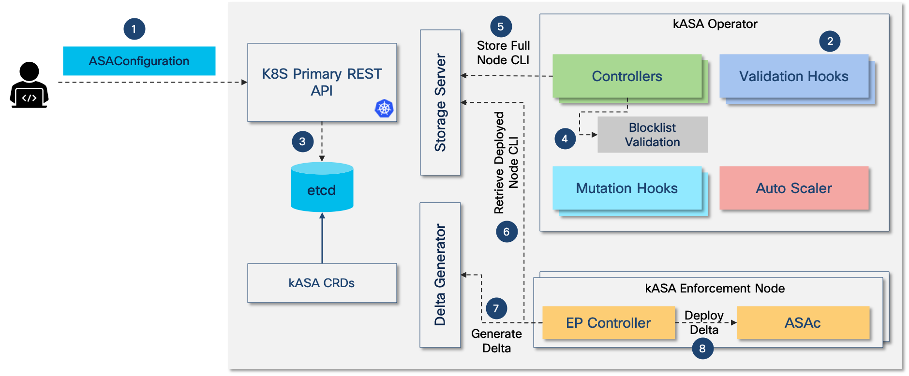

# Cisco Secure Firewall Cloud Native on AWS Cloud

This Quick Start deploys Cisco Secure Firewall Cloud Native on AWS Cloud in a highly available configuration.

The Quick Start offers two deployment options:
- Deploying KubeSphere on EKS into a new VPC on AWS
- Deploying KubeSphere on EKS into an existing VPC on AWS

## Product Overview

As the industry moves towards Infrastructure as Code (IaC) and the throughput requirements increase beyond what can be provided by the
existing ASA solutions, providing a horizontally scalable alternative becomes critical to answer these new demanding requirements.

ASA in a containerized form factor (ASAc) managed via an industry leading orchestration solution like Kubernetes (K8s) represents the
perfect answer to these requirements.

As depicted in the high-level diagram above, K8s+ASAc is composed of various K8s operators/controllers in addition to the ASAc. ASAc and
the K8s controllers used to manage the ASA container in the K8s cluster are also referred to as kASA. The underlying Cisco’s K8s service
infrastructure, called Aegis, is described in a separate document.

K8s exposes a plain text file (YAML) configuration mechanism conductive to IaC type of config management, K8s also supports REST APIs that
allow more advanced and complex levels of integration and programmability. In addition to that, K8s integration with various underlying VM
infrastructure provides integrated auto-scaling without additional effort.

---

### Architecture Overview

The kASA Control Plane (CP) manages the different ASAc service instances, and it is tasked with preserving and distributing configurations, monitoring
the status of the instances, interacting with external actors and several other functionalities. The CP is built around the K8s infrastructure, it
reuses as much as possible its user interaction paradigm familiar to all practitioners of the fastest growing container management infrastructure
for large cloud-based and on-premises data-centers.

CP utilizes the Custom Resource Definitions (CRDs) to extend K8s functionality and to provide the custom REST endpoints that can be used to interact
with the CP programmatically or via the standard K8s command-line tool: `kubectl`. CP also utilizes Kubebuilder's `controller-gen` and the Aegis Helm
libraries to generate and build its K8s components.

Following the robust K8s approach, all CP components are asynchronous, event driven, and eventually-consistent with the end goal of matching the final
running configuration of all ASAc service with the customer request.

