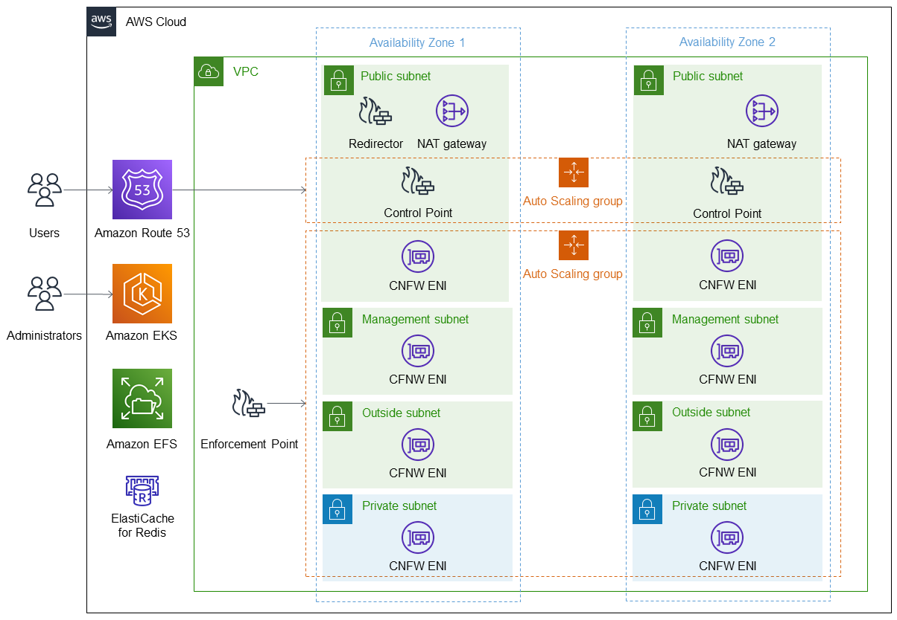

:xrefstyle: short

Deploying this Quick Start with default parameters builds the following {partner-product-short-name} environment in the
AWS Cloud.

// Replace this example diagram with your own. Follow our wiki guidelines: https://w.amazon.com/bin/view/AWS_Quick_Starts/Process_for_PSAs/#HPrepareyourarchitecturediagram. Upload your source PowerPoint file to the GitHub {deployment name}/docs/images/ directory in its repository.

[#architecture1]
.Quick Start architecture for {partner-product-short-name} on AWS

As shown in <<architecture1>>, the Quick Start sets up the following:

* One VPC per Cisco Secure Firewall Cloud Native (SFCN).
** The VPC spans two Availability Zones configured with public and private subnets, according to AWS best practices.
** The SFCN cluster uses Amazon EKS to build resiliency and provide multi-az architecture.
* Amazon Route53 provides VPN load balancing and CNFW health monitoring
* In the public subnets:
** The SFCN Control Point (CP) is responsible for configuration, licensing, and route management.
** The SFCN Enforcement Point (EP) is responsible for handling traffic.
** The SFCN architecture uses two autoscale groups (one for the control point and other one for the enforcement point).
** One EFS per cluster for SFCN CP and EP (optional).
** ElastiCache for Redis and SFCN are optional components for intelligent VPN load balancing.
** Managed network address translation (NAT) gateways to allow outbound internet access for resources in the private subnets.
