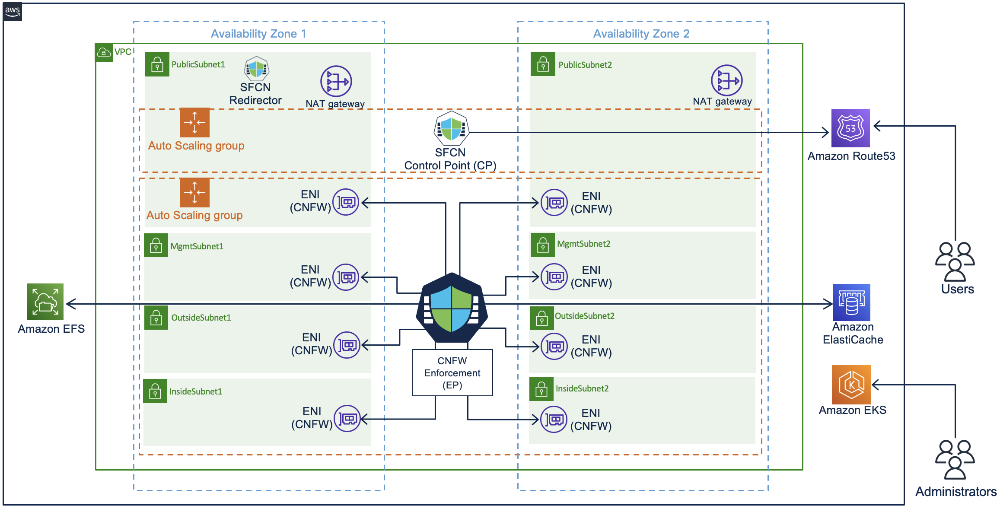

:xrefstyle: short

Deploying this Quick Start for a new virtual private cloud (VPC) with
default parameters builds the following {partner-product-short-name} environment in the
AWS Cloud.

// Replace this example diagram with your own. Follow our wiki guidelines: https://w.amazon.com/bin/view/AWS_Quick_Starts/Process_for_PSAs/#HPrepareyourarchitecturediagram. Upload your source PowerPoint file to the GitHub {deployment name}/docs/images/ directory in this repo. 

[#architecture1]
.Quick Start architecture for {partner-product-short-name} on AWS

As shown in <<architecture1>>, the Quick Start sets up the following:

* One VPC per Cisco Secure Firewall Cloud Native. SFCN provides a highly available architecture that spans two Availability Zones.
* SFCN cluster uses Amazon EKS to build resiliency and provide multi-az architecture.
* A VPC configured with public and private subnets, according to AWS best practices.
* Amazon Route53 provides VPN load balancing and CNFW health monitoring
* In the public subnets:
** Cisco Secure Firewall Cloud Native control point responsible for config, license and route management.
** Cisco Secure Firewall Cloud Native enforcement point responsible for handling traffic.
** SFCN architecture uses two autoscale groups (one for control point and other one for enforcement point).
** One EFS per cluster for SFCN CP and EP (optional).
** ElastiCache for Redis and SFCN are optional components for intelligent VPN load balancing.
** Managed network address translation (NAT) gateways to allow outbound internet access for resources in the private subnets.

* In the private subnets:
** AWS lambda functions that talk to Cisco Secure Firewall Cloud Native infrastructure.

// Add bullet points for any additional components that are included in the deployment. Make sure that the additional components are also represented in the architecture diagram. End each bullet with a period.
// * <describe any additional components>.

//[.small]#* The template that deploys the Quick Start into an existing VPC skips the components marked by asterisks and prompts you for your existing VPC configuration.#
